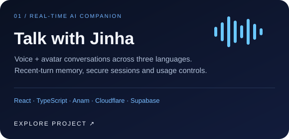
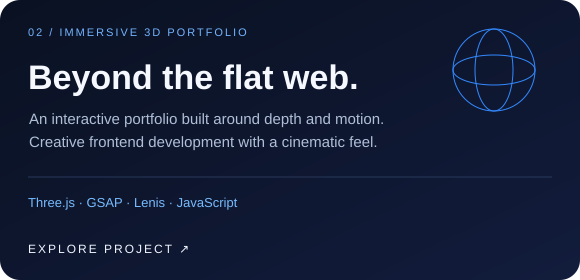
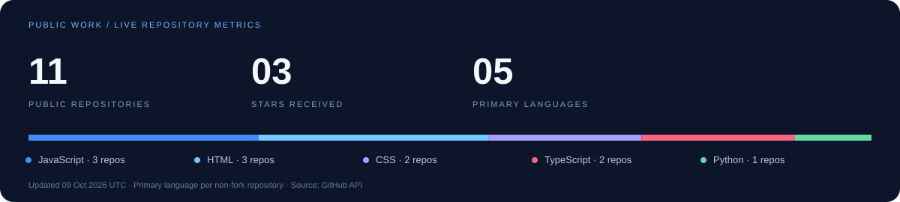

  

  
  

I'm **Jevin**, a web/UI designer and full-stack developer based in Ahmedabad, India. I turn visual ideas into working products: immersive websites, conversational AI experiences, internal tools, and API integrations.

### 01 / Selected work

<table>
  <tr>
    <td width="50%"></td>
    <td width="50%"></td>
  </tr>
  <tr>
    <td><strong>Jinha AI Companion</strong> Anam-powered voice and avatar app with English, Korean and Spanish conversation, per-user recent-turn memory, Supabase sign-in, and server-side call budgets.  <a href="https://github.com/jevin042/jinha-companion">Source + architecture ↗</a> · <a href="https://jinha-companion.jinha-companion.workers.dev/">Demo interface ↗</a> Live conversations require an invited account and provider availability.</td>
    <td><strong>Interactive Portfolio</strong> An immersive showcase using Three.js, GSAP and Lenis. A focus on spatial interfaces, motion and responsive frontend development.  <a href="https://github.com/jevin042/portfolio-3d">Source ↗</a> · <a href="https://jevin042.github.io/portfolio-3d/">Live website ↗</a></td>
  </tr>
</table>

| Project | Experience | Explore |
| :--- | :--- | :--- |
| **Midnight Listening Room** | Interactive 3D music room synced with a YouTube channel | [Live ↗](https://jevin042.github.io/midnight-listening-room/) · [Code](https://github.com/jevin042/midnight-listening-room) |
| **Villa Aurelia** | Cinematic, scroll-driven property showcase | [Live ↗](https://jevin042.github.io/villa-aurelia/) · [Code](https://github.com/jevin042/villa-aurelia) |
| **Aurum Evening** | Immersive restaurant experience with time-driven navigation | [Live ↗](https://jevin042.github.io/aurum-evening/) · [Code](https://github.com/jevin042/aurum-evening) |
| **JA Studio** | Responsive business landing page | [Live ↗](https://jevin042.github.io/ja-studio/) · [Code](https://github.com/jevin042/ja-studio) |

### 02 / What I bring to a project

| Design + frontend | Applications + AI | Integrations + delivery |
| :--- | :--- | :--- |
| Web/UI design, responsive interfaces, interactive 3D, motion | React/TypeScript applications, live AI avatars, authentication, conversation memory | REST APIs, workflow automation, Cloudflare Workers, Supabase, Git |

### 03 / Tools I build with

   
  

### 04 / On GitHub

Public repository metrics update daily through GitHub Actions. Private client work is excluded.

  

